# TranscribEdit

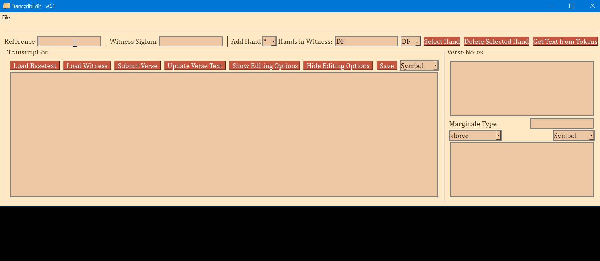
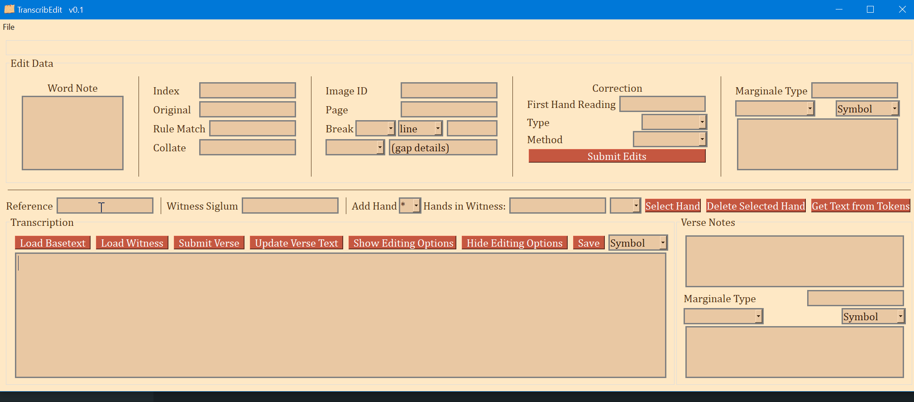

This is a transcription editor developed specifically for preparing transcriptions files that are compatible with the Institute for Textual Scholarship and Electronic Editing Collation Editor (https://github.com/itsee-birmingham/standalone_collation_editor).

TranscribEdit is basically an alternative to available WYSIWYG XML TEI text editors. Transforming XML TEI encoded transcription files to the tokenized JSON format required by the Collation Editor was too labor intensive for my workflow. This is an app to work natively in a compatible JSON format. It is also developed under the assumption that, if desired, it will be much easier to add a function for converting the tokenized JSON into valid TEI XML. Since TEI is still the standard in Digital Humanities around the world, I hope to add a 'JSON to TEI' export function eventually.

The strength of this editor is that it produces and retrieves transcriptions files that require no conversion at all to be used with the collation editor. Perhaps the biggest drawback of this editor is that it was developed to transcribe one verse at a time. A full-chapter view can be enabled from the settings menu, but this is for viewing and copying, not for editing.

I use this editor daily for my doctoral research and so it is being actively improved as I think of useful features that help with my own research.

## Installation
### Windows
Windows users can simply download and run the MSI installer. The installer was built with `briefcase` from Beeware (https://github.com/beeware/briefcase).
### Other Platforms
Mac users should, theoretically, be able to run this as a Python module. *However*, I have barely tested the app on anything other than Windows. The GUI needs significant tweaking to get the proportions correct on MacOS. The GUI library is Qt via `PySide2` and the abstraction library `PySimpleGUIQt`.

## Tutorial
### Set Settings
A few things need to be set before TranscribEdit is able to save and open files. So set the app up, open the settings window by clicking File>Settings

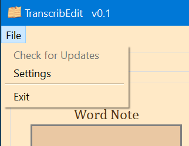

This will open a small settings window.

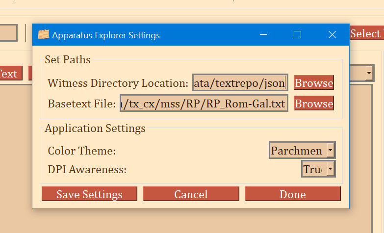

- Set the 'Witness Directory Location' by clicking 'Browse' and navigating to a folder in which all transcription files will be saved and from which they can be retrieved for viewing. 
  - It is highly recommended that this be the folder in which the Collation Editor expects the transcription files to be. Setting this as the save location will make things easier later. 
  - After downloading or cloning the Standalone Collation Editor folder, save it wherever is convenient. Then click 'Browse' to the right of 'Witness Directory Location' and go to the Collation Editor folder, then go to `collation/data/textrepo/json`. Select the `json` folder. Now the transcription files will be saved in the necessary directory structure in the necessary location.
- The 'Basetext File' is optional but highly recommended. A basetext file is not provided with TranscribEdit and must be supplied by the user. It should be formatted so that each verse (or other small unit) begins a new line and each verse must be preceded by a full SBL style reference, e.g. Rom 1:1 and 2 Cor 6:18. Having a basetext file allows the user modify a text file so that it matches the witness instead of typing it out from scratch. Click 'Browse' and select your basetext file.
- The other settings merely cosmetic.
### Transcription Box
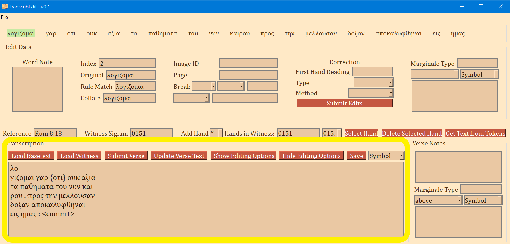
The transcription text box is where the manuscript transcription is typed. It can be treated like a plain text editor, but there are a few helpful features:
- Words that are split over a break: When a word is split due to a line break, column break, or page break, simply type a hyphen ("-") where the break appears and hit Enter to move to a new line. If this convention is used, then the word will be correctly rejoined when it is sent to the Collation Editor.
- Any text enclosed in angle brackets like \<this\> will be ignored. It is helpful for any notes the user would like to make such as marking the position and number of commentary lines or the place of a page/column break.
- Anything enclosed in curly braces like {this} will also be ignored as far as collation is concerned. It is offered to the user as another way to embed notes directly in the transcription that will not affect collation. 
- Commonly needed special characters have shortcuts. F4 inserts a Greek high dot and F5 inserts an overline. These only work for the transcription text box.
- All punctuation should have a space before and after so that it can be ignored for the purpose of collation.
- Helpful markup shortcuts: There are a few built in ways to automatically encode gaps and breaks so that they do not need to be manually entered using the token editor.
  - Simple line breaks will be automatically encoded when the final word of a line is followed by a space *and* a new line. For line breaks that split words, simply type hyphen "-", then enter a new line (with Enter or Return).
  - Column breaks and page breaks work the same but with the addition of `<cb>` or `<pb>` (respectively) as the first word of the next line. The sudo XML element should be followed by a space before the first word of the new line. 
  - Split words can be automatically encoded by using hyphen, *no space*, a new line, one of the above tags indicating a column break or page break, followed by the rest of the word. There should be no spaces between the first half of the word and the second half.
  - Alternative to `<cb>` and `<pb>` is `P|` and `C|`, and `-C-` and `-P-` for split words. The user should choose whichever they find most readable.
  - Gaps are automatically encoded whenever an entire word or group of words is enclosed in square brackets like [this]. If a word is partially reconstructed like th[is], then the word *is* sent for collation.
  
### Transcription Box Buttons from Left to Right
- 'Load Basetext': This will insert a verse from a basetext file. The basetext can be edited to match the witness being transcribed. See "Setting up the Basetext File" below for more info.
- 'Load Witness': If a valid reference is typed in the Reference input, and a valid witness siglum is typed into the Witness Siglum input, and if that file exists, it will be be fully loaded into TranscribEdit.
- 'Submit Verse': This sends the text from the transcription box to be converted into a tokenized JSON format. The text on the very top of the app shows what text will be sent to the Collation Editor.
- 'Update Verse Text': If any text in the transcription box is edited _after_ clicking 'Submit Verse' or saving the file, then use this button to update the text. No edit is permanent until the file is saved. 'Update Verse Text' does not change the JSON tokens, which means that changes made only in the transcription box will not affect the collation. To change previously submitted text, either click 'Submit Verse' again (but this will override any extra options encoded, if any!), or edit an individual word directly (see Editing Token Text below for more info).
- 'Show Editing Options' and 'Hide Editing Options' simply shows or hides the upper portion of the app. Hiding the token editing options is ideal when transcribing on the same monitor so that TranscribEdit can be made to be narrow for allowing the witness image to take as much of the screen space as possible.
- 'Save': If a witness folder with the witness siglum as its name does nto already exist, it will be created. Then the current transcription file will be saved into this folder and a metadata file required by the Collation Editor will also be written there.
- 'Symbol': This is dropdown menu that allows easy input of special characters such as underdots and staurograms.

### Token Words
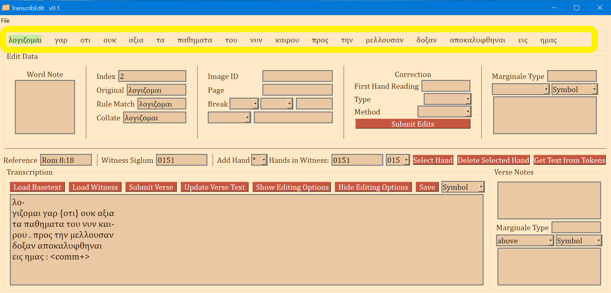

When words are submitted from the transcription box, they are converted to JSON tokens. Each token can have any number of the values from the 'Edit Data' frame. Each token has one word.
- The user can click on a word to select that token, or cycle to the previous one or next one with F11 and F12. 
- The token words show exactly what is going to be sent to the Collation Editor. If something doesn't look right, edit the text in the transcription box and resubmit the verse. This immediate feedback of how split words are joined (among other things) is one of the useful features.
- There are a few different characters that will be displayed before or after a word to give the user a quick sense of what kinds of data are encoded for that word.
  - " \* ": An asterisk indicates that a word note has been saved for the word.
  - " ^ ": A carat indicates that a marginal note has been saved for the word.
  - " ` ": A carat indicates that correction has been saved for the word.
  - " | ": A bar indicates that there is a break before, after, or splitting the word. A bar by itself indicates a line break while the location of the bar communicates whether the break is before, in, or after the word.
  - " P| ": Page break
  - " C| ": Column break
  - " -C- ": Word split on a column break
  - " -P- ": Word split on a page break

### Edit Token Options frame
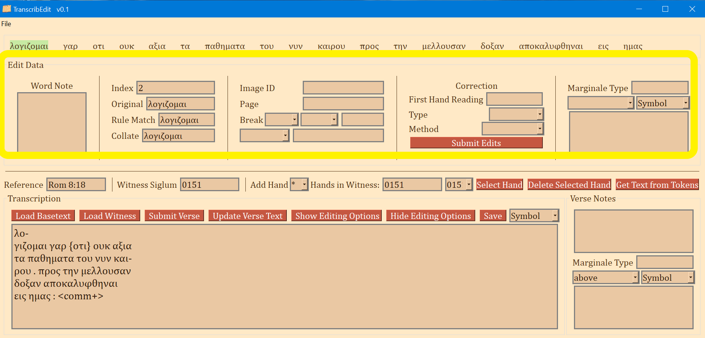
From top to bottom, left to right:
- 'Word Note' is any note the user wishes to make about that word. Every word can have a unique note.
- 'Index': The Collation Editor requires that every word be given an index that begins with '2' and continues with +2 for each word.
- 'Original': According to the Collation Editor documentation, this should be the unregularized reading with any reconstructions or underdots. In my experience, this is the word sent for collation, therefore, things such as underdots, overlines, and square brackets are automatically removed. This word can be edited--it is the easiest way to edit a reading after submitting the words.
- 'Rule Match': According to the Collation Editor documentation, this can be a list of words for which the user desires the word to be a match. I am not sure how to configure the Collation Editor to take advantage of this feature. Unless you can configure the Collation Editor to use this, it is easiest to ignore this value.
- 'Collate': According to the Collation Editor documentation, this is the word sent to CollateX (the collation engine used by the Collation Editor). As things currently work, this should just be the same as 'Original.'
- 'Image ID': An optional value for the user to save a URL or filename for the image used during transcription.
- 'Page': An optional value for stating on which page the word is. This is especially useful when a verse spans multiple pages.
- 'Break': An optional value for communicating a break. There are three values for a break:
    1. The place of the break: 'before' the word, 'after' the word, or the word is 'split' over the break.
    2. Type of break: 'line', 'column', or 'page'
    3. Details such as the new line/column/page number
- 'gap after' and 'gap before': This is optional, but the Collation Editor will interpret it, so if it is relevant, it suse is highly recommended. This is for encoding lacunae. There are two values for this encoding:
    1. 'after' or 'before' tells the Collation Editor that there is a gap of some kind before or after the word for which the option is selected.
    2. Gap details go in the second input box. This will be displayed in the Collation Editor. I recommend keeping the details as short as possible, e.g. 'lac 1wrd' or 'lac 2ltrs'.
- 'First Hand Reading': an optional value. If a second hand has been added to the verse transcription file, this can be used as a convenient way to quickly communicate what the first hand reading is.
- 'Type' of correction.
- 'Method' of correction.
- 'Submit Edits' button *must* be clicked to save any edits made in the entire frame. F3 can also be used for this. If edits are made to a word token but then the user clicks on a different word, the changes will be lost.
- 'Marginale Type': the type of marginalia to be transcribed.
- Marginale location dropdown
- 'Symbol' is a dropdown that will insert commonly used symbols into the marginal transcription box.
- Marginale transcription box: here any marginalia near the word can be encoded.

### Middle Options Area
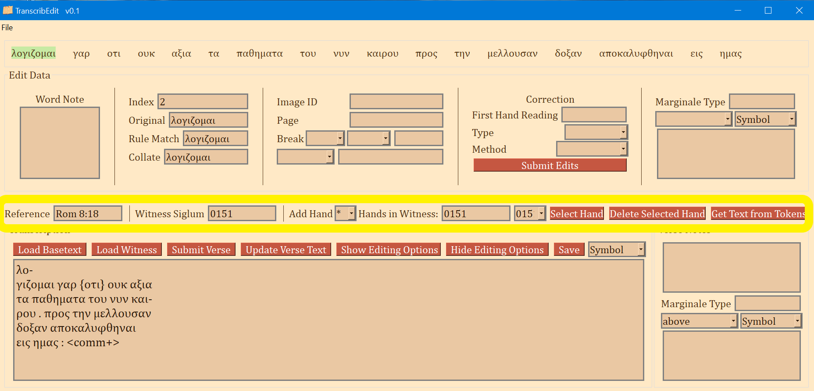
From left to right:
- 'Reference': The reference of a verse should always be typed here. SBL or INTF style reference styles are recommended. Spaces will automatically be removed when the file is saved. The 'Reference" input is for both retrieving a saved transcription file and for setting the filename of a new transcription file.
- 'Witness Siglum': The identifier of the witness. For New Testament Manuscripts, this will usually be a Gregory-Aland number.
- 'Add Hand': If there is a correction that the user wishes to encode, select the desired corrector designation from the dropdown menu, then edit the verse text in the transcription box so that it matches the corrector's text. Submit the corrector's text by clicking 'Submit Verse'. The Collation Editor will treat the corrector's text as a witness.
- 'Hands in Witness': this shows all hands that have been submitted.
- 'Select Hand': The dropdown to the left allows the user to select a hand; this button will load the transcription and tokens for the selected hand.
- 'Delete Selected Hand': This removes the *selected* hand, not the loaded hand. Remember: no changes are final until the file is saved with the 'Save' button or with F1.
- 'Get Text from Tokens': TranscribEdit can load files that were not made by the user. Other files, like those from the INTF VMR will not have plain text transcriptions. These files will load only the tokens, but nothing in the transcription box. This button will dump the token words into the transcription box for editing, if desired.

### Verse Notes
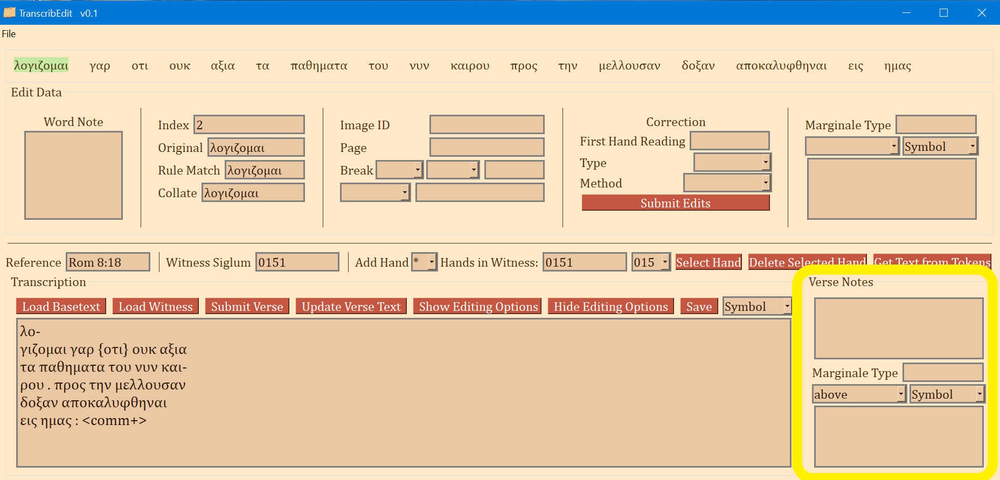
This section is like the word note and word marginale, except that it corresponds to the entire verse. It is optional but useful.

## Display Themes
Parchment
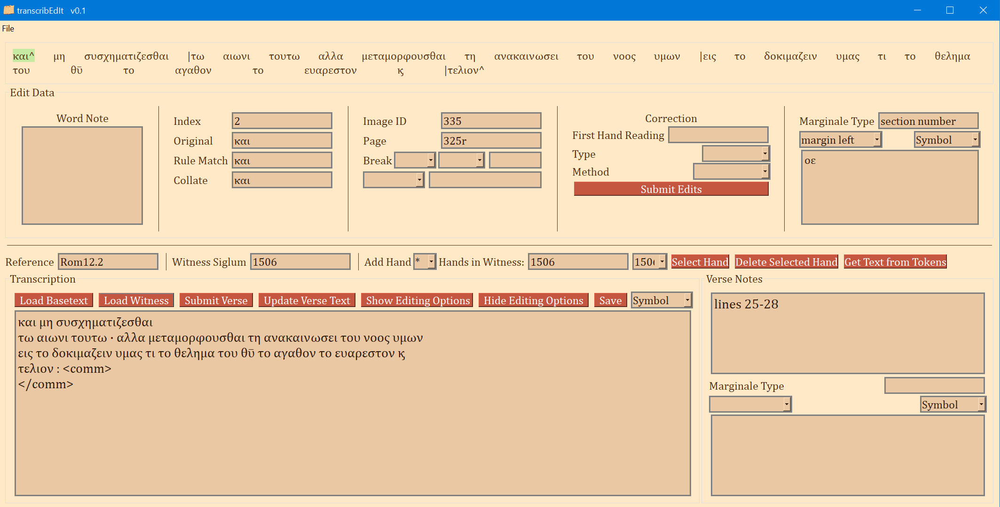
Dark Mode

Gray
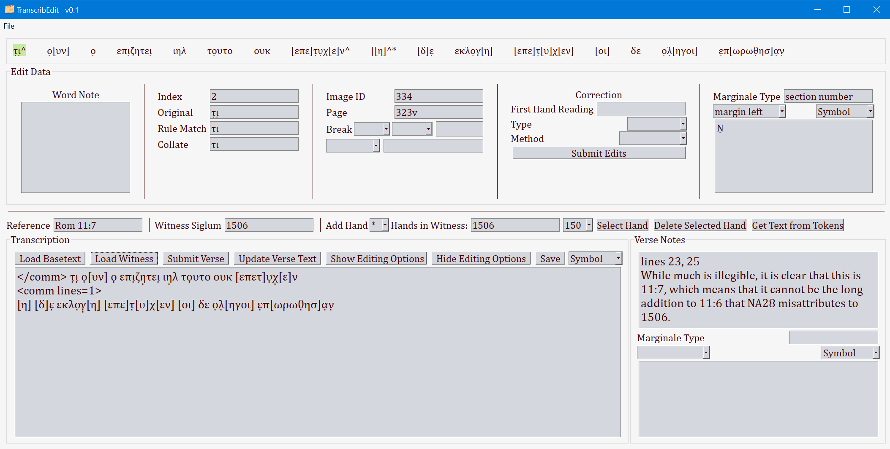