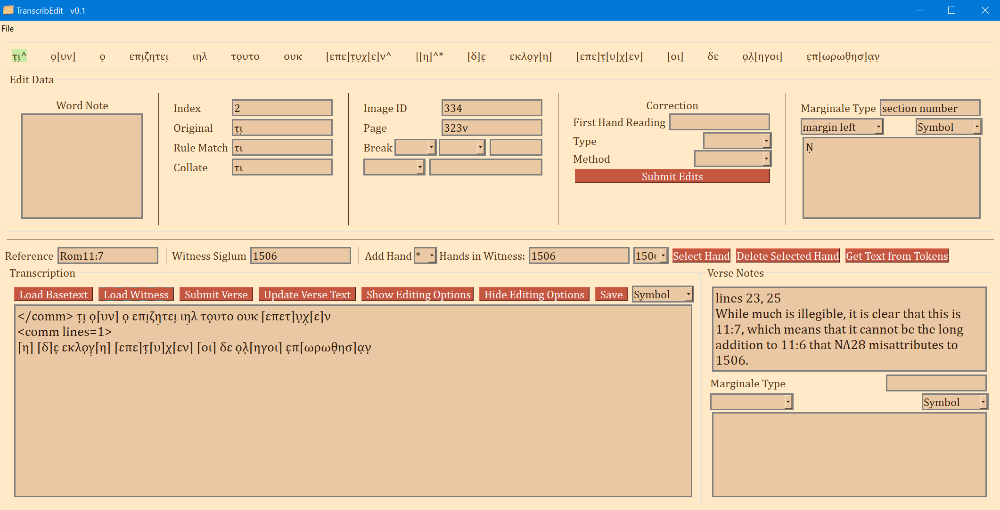
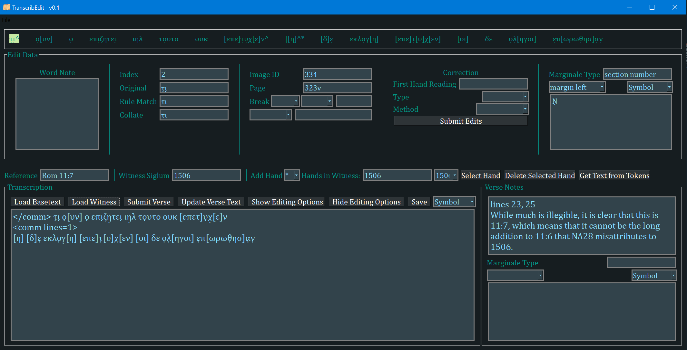

# TranscribEdit

This is a transcription editor developed specifically for preparing transcriptions files that are compatible with the Institute for Textual Scholarship and Electronic Editing collation editor (https://github.com/itsee-birmingham/standalone_collation_editor).

TranscribEdit is basically an alternative to XML TEI. Transforming XML TEI encoded transcription files to the tokenized JSON format required by the Collation Editor was too labor intensive for my workflow. This is an app to work natively in a compatible JSON format. It is also developed under the assumption that, if desired, it will be much easier to add a function for converting the tokenized JSON into valid TEI XML. Since TEI is still the standard in Digital Humanities around the world, I hope to add a 'JSON to TEI' export function eventually.

The strength of this editor is that it produces and retrieves transcriptions files that require no conversion at all to be used with the collation editor. Perhaps the biggest drawback of this editor is that it was developed to transcribe one verse at a time. A near-future goal is to display and export a 'page view' (if the user has chosen to encode page breaks and page numbers).

I use this editor daily for my doctoral research and so it is being actively improved as I think of useful features that help with my own research.

I will add documentation if/when anyone other than myself expresses interest in using it.

## Installation
### Windows
Windows users can simply download and run the MSI installer. The installer was built with `briefcase` from Beeware (https://github.com/beeware/briefcase).
### Other Platforms
Mac users should, theoretically, be able to run this as a Python module. *However*, I have barely tested the app on anything other than Windows. The GUI needs significant tweaking to get the proportions correct on MacOS. The GUI library is Qt via `PySide2` and the abstraction library `PySimpleGUIQt`.

## Display Themes
Parchment

Dark Mode

Gray
